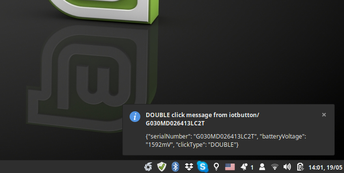
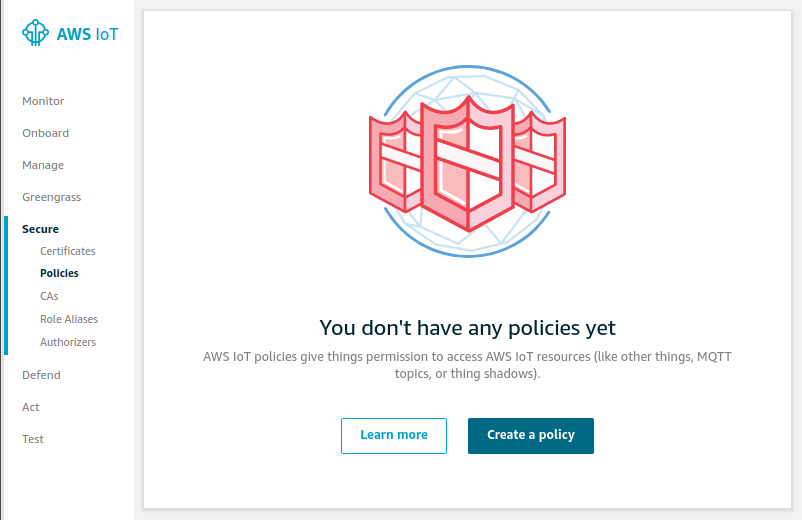
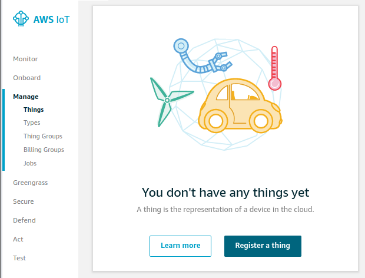
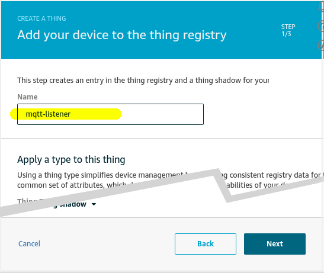
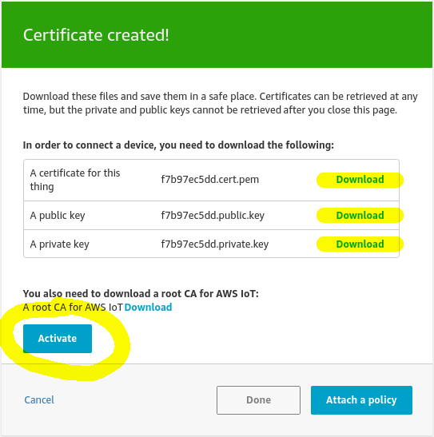
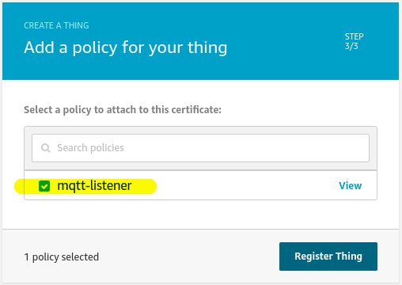
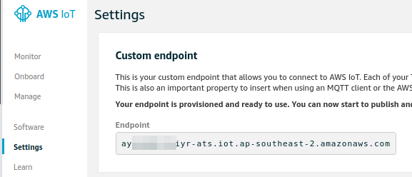
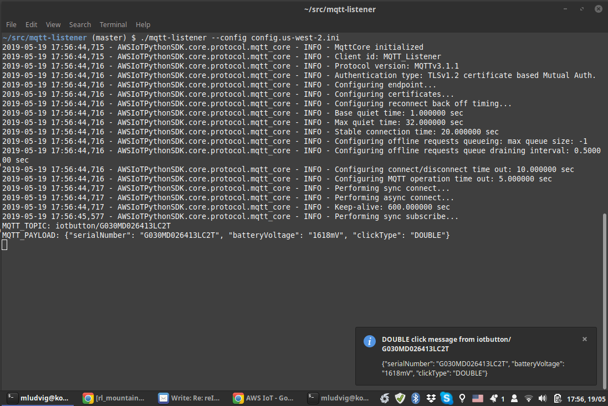

# AWS IoT MQTT Listener

Execute a custom shell script when a MQTT message is received from *AWS IoT
(Internet of Things) Topic*.

For example [AWS IoT Button](https://aws.amazon.com/iotbutton/) can be used to
send *Single*, *Double* or *Long click* MQTT message to AWS IoT Topic and
`mqtt-listener` can run a shell script whenever it happens.

In the simplest case the shell script can for example display a desktop notification.



The script can has access to the MQTT message payload and can modify its
behaviour based on the payload. For example display a notification for IoT
Button *Single click*, lock the screen for *Double click* and shut down the
computer for *Long click* - kids screen time management, wink, wink :)

## Configuration

The `mqtt-listener` is an [*AWS IoT
Thing*](https://docs.aws.amazon.com/iot/latest/developerguide/thing-registry.html)
in the AWS IoT terminology. That means it is a "device" (or a program in this case)
that subscribes to a *MQTT Topic* and can publish and receive messages.

Each *Thing*, including `mqtt-listener` needs at least a *SSL Certificate* and
*Thing Policy* that enable it to connect to AWS IoT *Endpoint* and subscribe to
the required MQTT *Topic*. In the next steps we're going to configure it all.

All the settings can be passed on the command line or saved to `config.ini`
file (see `config.template.ini`)

### Register an AWS IoT Button

This is an easy way to generate three different types of messages *at a push
of a button* (pun intended). We can certainly publish our messages through
some other means but for consistency I will assume that we are using [AWS
IoT Button](https://aws.amazon.com/iotbutton/) and it sends the messages to
topic `iotbutton/G012ABCD1234ABCD`. We'll take it from there.

### Create policy

Before we can create a *Thing* we need a policy that determines what the *Thing*
can do. Our `mqtt-listener` can only subscribe to *any* IoT Button topic and
listen for messages. Note that we are **not** creating and *IAM Policy* but
**instead** an *IoT Policy*!!



Here is the resulting *IoT policy* we need to create, give it a name for example
**mqtt-listener**.

```json
{
  "Version": "2012-10-17",
  "Statement": [
    {
      "Effect": "Allow",
      "Action": [
        "iot:Receive"
      ],
      "Resource": [
        "arn:aws:iot:ap-southeast-2:123456789012:topic/iotbutton/#"
      ]
    },
    {
      "Effect": "Allow",
      "Action": [
        "iot:Subscribe"
      ],
      "Resource": [
        "arn:aws:iot:ap-southeast-2:123456789012:topicfilter/iotbutton/#"
      ]
    },
    {
      "Effect": "Allow",
      "Action": [
        "iot:Connect"
      ],
      "Resource": [
        "arn:aws:iot:ap-southeast-2:123456789012:client/*"
      ]
    }
  ]
}
```

See that we use a *wildcard* -- iotbutton/**#** -- to allow access to all the 
IoT Button topics. To restrict access to a specific button replace
`iotbutton/#` with `iotbutton/G012ABCD1234ABCD` where the `G0123..` is the
button serial number.

### Create the Thing

Now that we have the *mqtt-listener policy* ready we can create the
**mqtt-listener thing**.



Just give it a **name** and don't worry about any other details. Those are optional
and you can play with them later.



Next we create the **SSL Certificates** by following the *One-click certificate
creation* link. *Download* all the generated files to `certificates/` directory.
Don't forget to *Activate* the certificate!



And finally attach the **IoT Policy** that we created earlier.



### Endpoint address

Endpoint address is the DNS name of the MQTT endpoint where `mqtt-listener` will
connect to. The address is unique to each AWS account and region.



### Configure `mqtt-listener`

Copy the `config.template.ini` file to `config.ini` and update at least the
`mqtt_endpoint`, `ssl_cert` and `ssl_key` settings.

```ini
[default]
script = ./sample-script.sh
mqtt_endpoint = ayzabcdeiyr-ats.iot.ap-southeast-2.amazonaws.com
mqtt_topic = "iotbutton/#"
ssl_root_ca = certificates/AmazonRootCA1.pem
ssl_cert = certificates/f7b97ec5dd-certificate.pem.crt
ssl_key = certificates/f7b97ec5dd-private.pem.key
```

If you are running on any modern Linux desktop you can test with the provided
`sample-script.sh`.



## Author

[Michael Ludvig](https://aws.nz)
